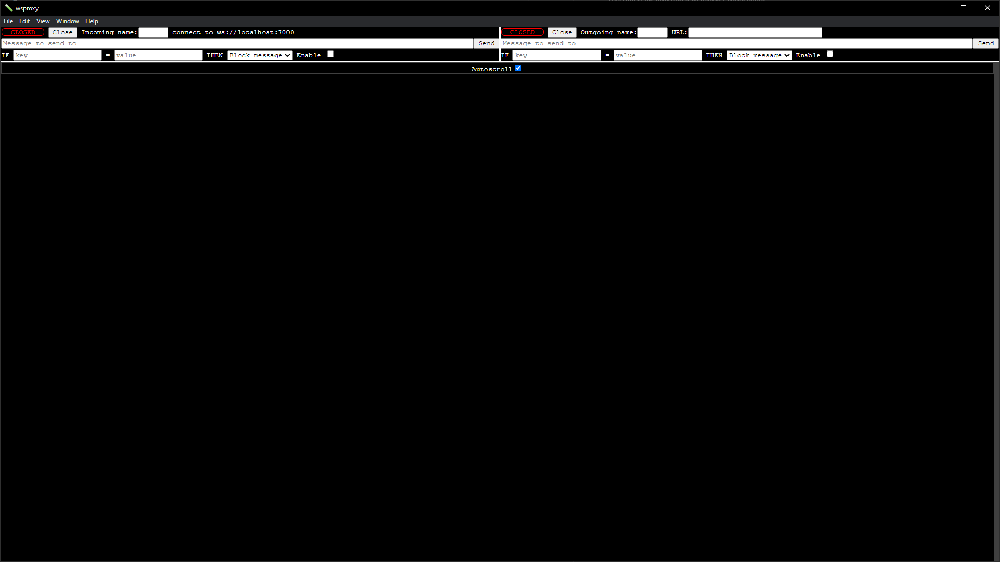

# Installation
```npm install```

# Usage
```npm start```

## Setup
1. Enter the name of the incoming websocket client in the "Incoming name" field
2. Enter the name of the outgoing websocket server in the "Outgoing name" field
3. Enter the address of the outgoing websocket server in the "URL" field

This configuration will be remembered in `config.json`

Once the incoming client connects to ws://localhost:7000 **wsproxy** will connect to the websocket specified in the URL field and will pass along any messages between them in both directions.

Messages that are sent from the client before the upstream server is ready will be cached and sent once the outgoing connection is ready.


Messages from [INCOMING] to [OUTGOING] will have green text

Messages from [OUTGOING] to [INCOMING] will have red text

Messages to/from the **wsproxy** tool itself will be in white

Messages to/from the cache will be highlighted with a background color rather than text color

## Interjecting messages

Custom messages can be entered into the "Messages" fields and clicking the "Send" button will interject that message to either the incoming websocket client with the left form or the outgoing websocket server with the right form.

## Intercepting messages

Rules can be setup with the forms such that any message with the provided **key** that matches the provided **value** will be blocked from reaching the other side of the connection, the message log will indicate it has been captured by **wsproxy** without forwarding it in white text

